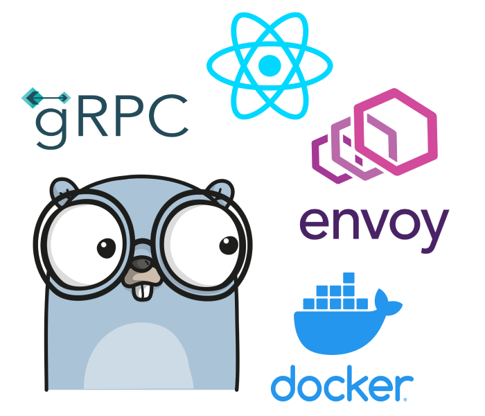

# README
A simple gRPC server built by **Go** + **React** + **Docker** + **Envoy**



## How to build
The easiest way to build the project with docker
```bash
docker compose build
```
or you can build it manually
- build backend go server
  ```bash
  go build -o server .
  ```
- build frontend react
  ```bash
  cd web
  npm run build
  ```
- dockerlize envoy proxy server
  ```bash
  docker build -t grpc-starter-envoy:1.0 .
  ```

## How to run
The easiest way, still start the project with docker
```bash
docker compose up -d
```
or you can start it manually
- after compiling, run envoy proxy server directly
  ```bash
  docker run -dp 8000:8000 grpc-starter-envoy:1.0
  ```
- run the compiled go executable binary
  ```bash
  ./server
  ```
  or use go command
  ```bash
  go run main.go
  ```
- start react project
  ```bash
  npm run start
  ```

## Preview
After starting project, you can open browser http://localhost:3000 to see the final effect


## Deployment
[](https://heroku.com/deploy)

